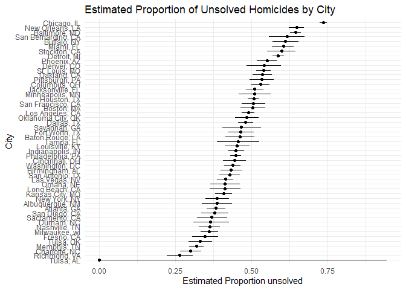

P8105 Homework 5
================
Satya Batna

------------------------------------------------------------------------

## Problem 1

<!-- -->

The resulting plot shows a nonlinear increase in the probability as
group size grows. When groups are small, the probability of a shared
birthday is low. The probability starts increasing more noticeably
around group sizes 15–20 people, and by approximately 23 people the
probability reaches about 50 percent. For groups of 50, the probability
is nearly 100 percent so it is almost gaurannteeed that someone will
share birthdays in this simualtion.

## Problem 2

    ## # A tibble: 7 × 2
    ##   mu_true  power
    ##     <int>  <dbl>
    ## 1       0 0.0508
    ## 2       1 0.189 
    ## 3       2 0.568 
    ## 4       3 0.887 
    ## 5       4 0.992 
    ## 6       5 1     
    ## 7       6 1

<!-- -->

    ## # A tibble: 7 × 3
    ##   mu_true mean_est_all mean_est_sig
    ##     <int>        <dbl>        <dbl>
    ## 1       0    -0.000262       0.0426
    ## 2       1     0.996          2.21  
    ## 3       2     2.00           2.60  
    ## 4       3     2.99           3.18  
    ## 5       4     3.99           4.01  
    ## 6       5     5.01           5.01  
    ## 7       6     6.02           6.02

<!-- --> 1. Power
vs. effect size

The plot with Power shows that when the true mean is zero, the null is
rejected about 0.05 or (5% of the time). As effect size increases, the
proportion of rejections rises too. This shows us that the larger effect
sizes the higher the power.

2.  Average estimate vs. true mean

The plot shows that the average estimate across all simulations is very
close to the true mean, which means the sample mean is unbiased, But,
when looking only at simulations where the null hypothesis was rejected,
the average estimate is higher than the true mean, especially when the
true mean is small. This happens because we are only keeping the samples
that are significant, which causes the estimates in that group to be
higher.

    ## Rows: 52179 Columns: 12
    ## ── Column specification ────────────────────────────────────────────────────────
    ## Delimiter: ","
    ## chr (9): uid, victim_last, victim_first, victim_race, victim_age, victim_sex...
    ## dbl (3): reported_date, lat, lon
    ## 
    ## ℹ Use `spec()` to retrieve the full column specification for this data.
    ## ℹ Specify the column types or set `show_col_types = FALSE` to quiet this message.

    ## # A tibble: 51 × 3
    ##    city_state      total_homicides unsolved_homicides
    ##    <chr>                     <int>              <int>
    ##  1 Albuquerque, NM             378                146
    ##  2 Atlanta, GA                 973                373
    ##  3 Baltimore, MD              2827               1825
    ##  4 Baton Rouge, LA             424                196
    ##  5 Birmingham, AL              800                347
    ##  6 Boston, MA                  614                310
    ##  7 Buffalo, NY                 521                319
    ##  8 Charlotte, NC               687                206
    ##  9 Chicago, IL                5535               4073
    ## 10 Cincinnati, OH              694                309
    ## # ℹ 41 more rows

    ## # A tibble: 1 × 3
    ##   city_state    total_homicides unsolved_homicides
    ##   <chr>                   <int>              <int>
    ## 1 Baltimore, MD            2827               1825

    ## # A tibble: 1 × 8
    ##   estimate statistic  p.value parameter conf.low conf.high method    alternative
    ##      <dbl>     <dbl>    <dbl>     <int>    <dbl>     <dbl> <chr>     <chr>      
    ## 1    0.646      239. 6.46e-54         1    0.628     0.663 1-sample… two.sided

    ## # A tibble: 51 × 6
    ##    city_state     total_homicides unsolved_homicides estimate conf.low conf.high
    ##    <chr>                    <int>              <int>    <dbl>    <dbl>     <dbl>
    ##  1 Albuquerque, …             378                146    0.386    0.337     0.438
    ##  2 Atlanta, GA                973                373    0.383    0.353     0.415
    ##  3 Baltimore, MD             2827               1825    0.646    0.628     0.663
    ##  4 Baton Rouge, …             424                196    0.462    0.414     0.511
    ##  5 Birmingham, AL             800                347    0.434    0.399     0.469
    ##  6 Boston, MA                 614                310    0.505    0.465     0.545
    ##  7 Buffalo, NY                521                319    0.612    0.569     0.654
    ##  8 Charlotte, NC              687                206    0.300    0.266     0.336
    ##  9 Chicago, IL               5535               4073    0.736    0.724     0.747
    ## 10 Cincinnati, OH             694                309    0.445    0.408     0.483
    ## # ℹ 41 more rows

<!-- -->
Chicago, IL seem to have the most unsolved cases, probably why every
crime show takes place there. Tulsa, AL has the least unsolved cases.
