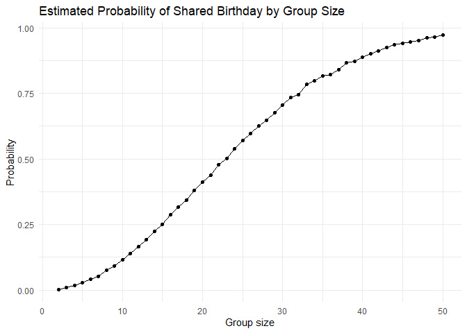
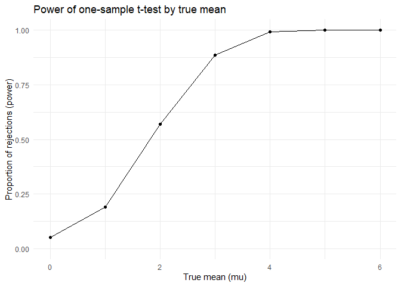
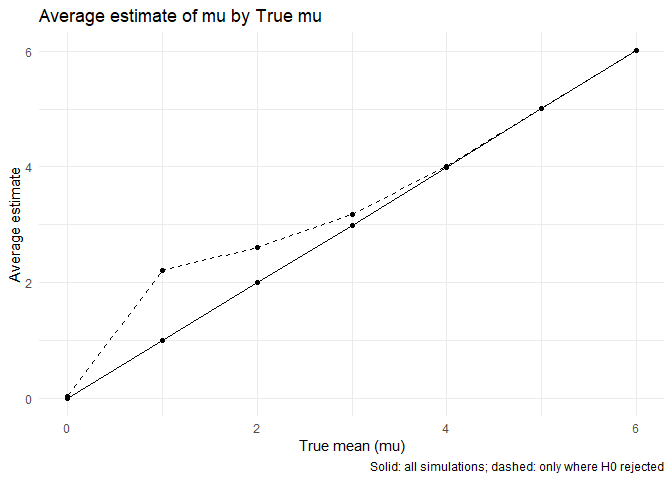

P8105 Homework 5
================
Satya Batna

------------------------------------------------------------------------

## Problem 1

<!-- -->

The resulting plot shows a nonlinear increase in the probability as
group size grows. When groups are small, the probability of a shared
birthday is low. The probability starts increasing more noticeably
around group sizes 15–20 people, and by approximately 23 people the
probability reaches about 50 percent. For groups of 50, the probability
is nearly 100 percent so it is almost gaurannteeed that someone will
share birthdays in this simualtion.

## Problem 2

    ## # A tibble: 7 × 2
    ##   mu_true  power
    ##     <int>  <dbl>
    ## 1       0 0.0508
    ## 2       1 0.189 
    ## 3       2 0.568 
    ## 4       3 0.887 
    ## 5       4 0.992 
    ## 6       5 1     
    ## 7       6 1

<!-- -->

    ## # A tibble: 7 × 3
    ##   mu_true mean_est_all mean_est_sig
    ##     <int>        <dbl>        <dbl>
    ## 1       0    -0.000262       0.0426
    ## 2       1     0.996          2.21  
    ## 3       2     2.00           2.60  
    ## 4       3     2.99           3.18  
    ## 5       4     3.99           4.01  
    ## 6       5     5.01           5.01  
    ## 7       6     6.02           6.02

<!-- -->
